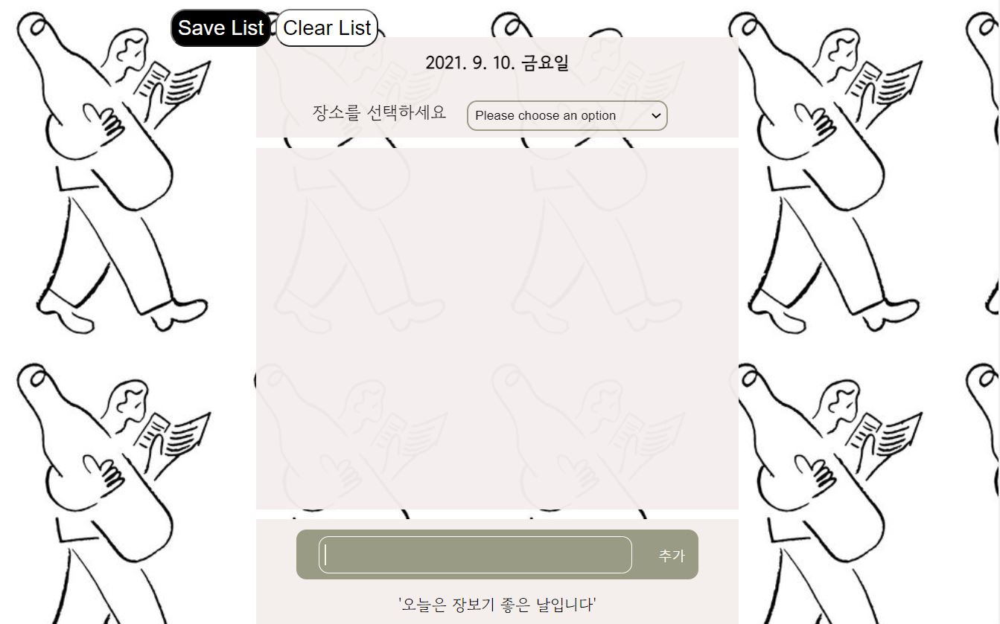
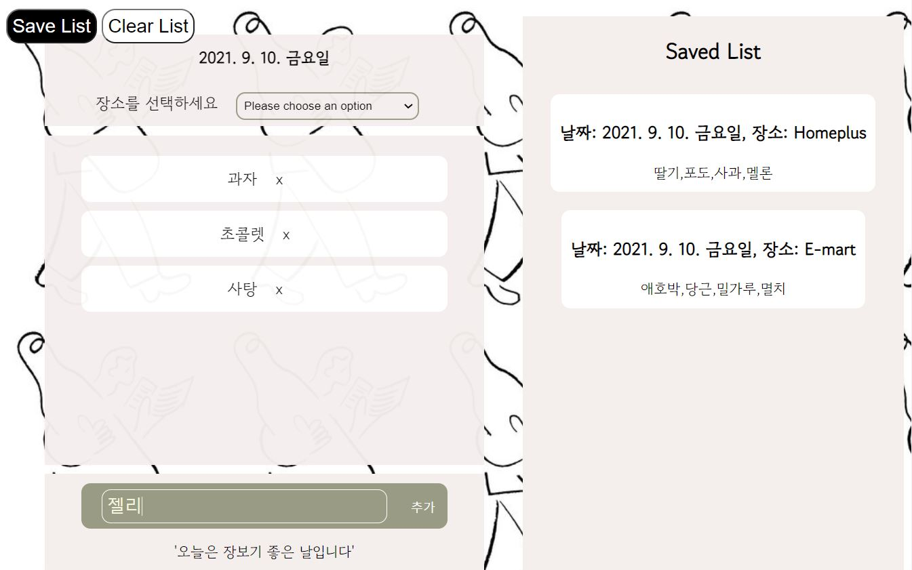
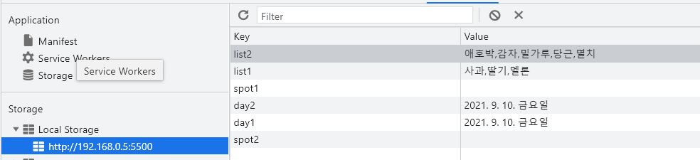

# shoppingList

### 웹사이트 접속하기
<a href="https://today-shoppinglist.netlify.app/shoppinglist">웹사이트로 이동하기</a>

### 서비스 소개
쇼핑 리스트를 미리 적어서 장보러 갈때 까먹지 않도록 도와주는 어플리케이션

### 기간
21.09.09 ~ 21.09.10

### TECH STACK
- Javascript, HTML, CSS,
- web local storage(데이터 저장), netlify(배포)

### 결과물 & 기능
1. 쇼핑 리스트를 작성할 수 있는 메인 화면

- 초록색 창에서 리스트 아이템을 작성해서 추가 버튼을 누르거나 엔터를 치면 위의 박스에 아이템이 한 개씩 추가할 수 있다

2.  쇼핑리스트를 작성해서 save List를 누르면 오른쪽에 리스트를 저장하는 공간이 생기면서 저장된 리스트를 볼 수 있는 화면

- 저장된 리스트가 있으면 옆에 저장된 리스트 박스가 추가된다
- clear List를 누르면 저장된 전체 리스트를 삭제할 수 있다
- 각 아이템을 삭제하고 싶다면, 아이템 옆에 있는 x를 누르면 삭제가 가능하다

3. 쇼핑 리스트를 저장하고나서 로컬에서 계속 기록을 남길 수 있도록 웹 로컬 스토리지에 저장한 모습

- 삭제하지 않으면 기록은 로컬에서 계속 유지가 가능하다

### 배운점
- 로컬, 세션 스토리지는 개발자도구에서 application - storage에서 확인이 가능하다
- 로컬 스토리지: 브라우저에서 로컬 스토리지를 삭제하지 않는다면 브라우저가 닫혀도 스토리지의 데이터는 계속 남아있다
- 세션 스토리지: 브라우저가 닫히면 데이터도 힘께 사라진다
- 데이터 저장, 가져오기, 삭제 메서드: localStorage.setItem(key, value), localStorage.getItem(key, value), localStorage.clear()

### 더 배워야 할 점 & 개선할 점
- 더 많은 데이터 저장이 필요힌 경우, firebase를 적용해보자(간단한 경우라 사용했지만 웹 스토리지가 정답은 아니다)
- 저장된 리스트도 따로 삭제가 가능하도록 기능 추가해보기

